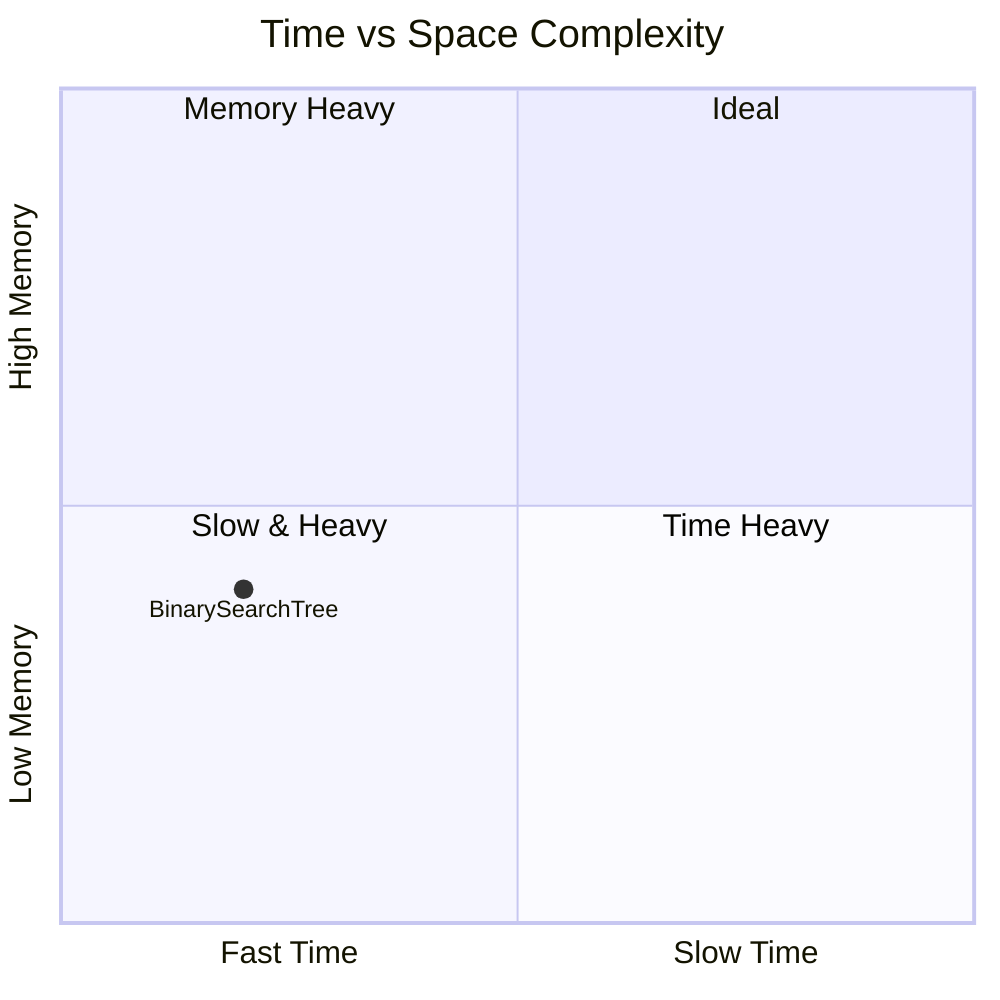

# Complexity Analysis

DSA-SPEC can generate cross-DSA complexity reports from the `complexity` annotations in spec files.

## Annotation Format

Each spec file has a `complexity` block in its `metadata`:

```yaml
metadata:
  name: "BinarySearchTree"
  category: "trees"
  complexity:
    time: "O(log n) average, O(n) worst"
    space: "O(n)"
```

- `time` (optional): Big-O notation for time complexity
- `space` (optional): Big-O notation for space complexity

Both are free-form strings — any format is accepted.

## CLI Usage

```bash
dsa-spec analyze [<dir>] [--format <format>]
```

- `<dir>`: Path to directory containing spec YAML files (default: `specs/`)
- `--format` / `-f`: Output format (default: `table`)

### Formats

#### `table` (default)
Terminal-friendly markdown table comparing all DSA specs:

```
| DSA | Category | Time Complexity | Space Complexity |
|---|---|---|---|
| BinarySearchTree | trees | O(log n) average, O(n) worst | O(n) |
| AVLTree | trees | O(log n) search/insert/delete | O(n) |
| DynamicArray | arrays | O(1) amortized push, O(n) insert/remove | O(n) |
```

#### `markdown`
Same as `table` — produces the same markdown table.

#### `json`
Machine-readable JSON array:

```json
[
  {
    "name": "BinarySearchTree",
    "category": "trees",
    "time": "O(log n) average, O(n) worst",
    "space": "O(n)"
  }
]
```

#### `chart`
Mermaid quadrant chart visualizing time vs space tradeoffs:



Big-O strings are mapped to approximate numeric positions:
| Complexity | Ordinal |
|---|---|
| O(1) | 0.05 |
| O(log n) | 0.2 |
| O(n) | 0.4 |
| O(n log n) | 0.6 |
| O(n^2) | 0.8 |
| O(2^n) | 0.95 |
| O(V+E) | 0.55 |

Unknown or unparseable complexity strings are skipped in the chart.

## Examples

```bash
# Full comparison table
dsa-spec analyze

# JSON for external tooling
dsa-spec analyze --format json

# Tradeoff visualization chart
dsa-spec analyze --format chart

# Analyze a custom directory
dsa-spec analyze ../my-specs
```
